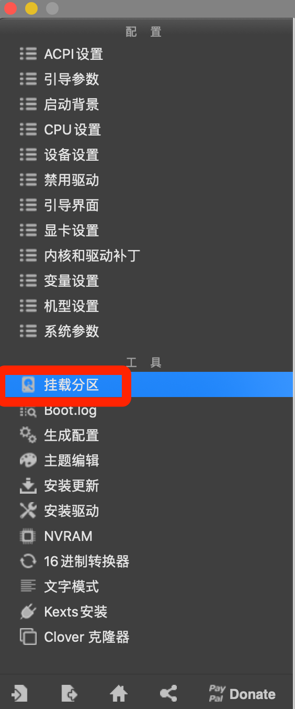
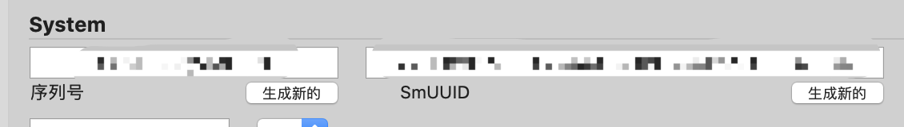
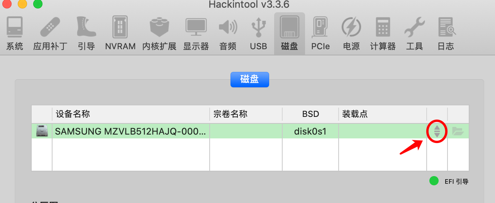
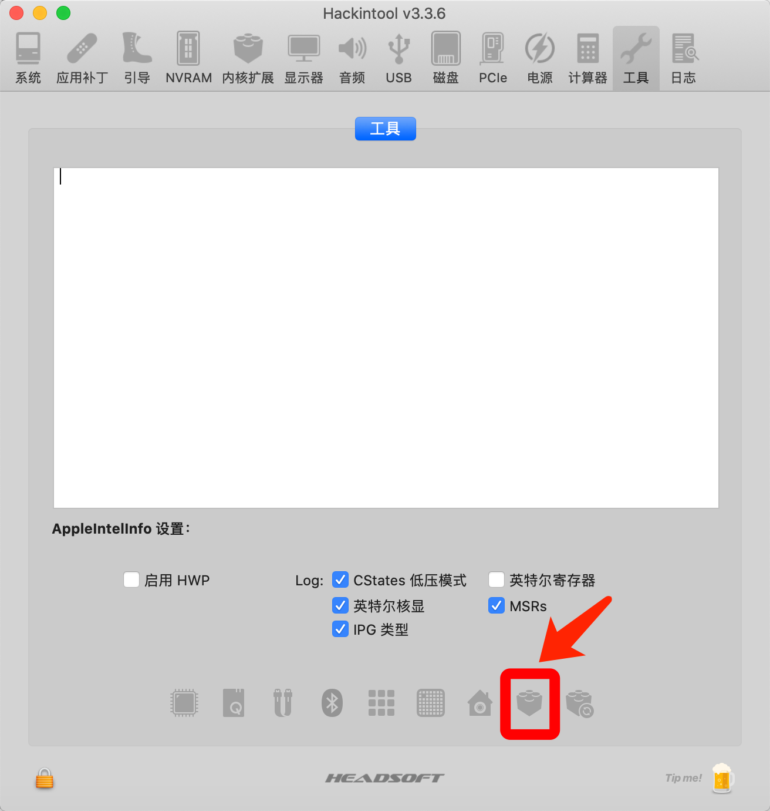
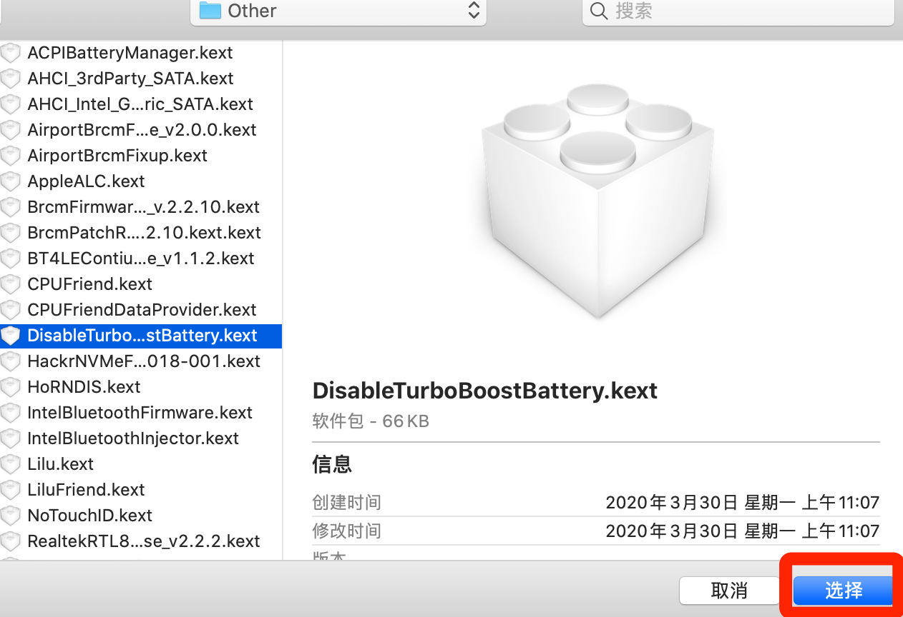
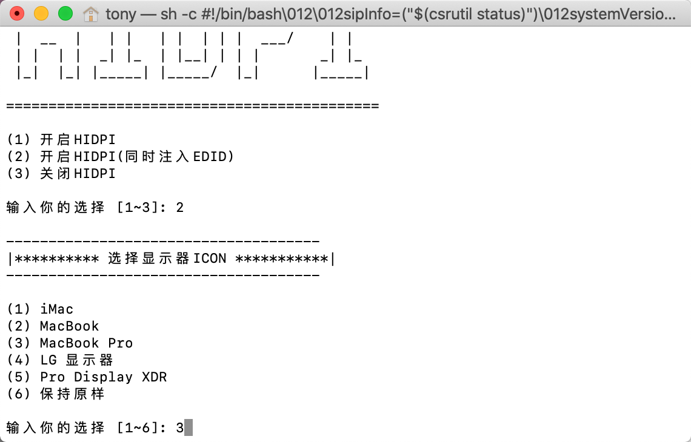

# **Hackintosh 10.15 Catalina for HP PAVILION GAMING LAPTOP 15-dk0xxx(2019 WITH 9TH GERERATION INTEL CORE I5/I7 PROCESSER)**

[中文版戳这里](https://github.com/Tonymiugrey/Garden-by-miugrey/blob/master/README_CN.md)

#### <u>**3.1.1 (Clover version) RELEASED!**</u>

This update fix the poor battery life TOTALLY!

USB 3.0 now is available (may not work on some devices sold in other countries, I only test it on the one sold in China...)

Added the itlwm to support the Intel WiFi. You need to install [HeliPort](https://github.com/OpenIntelWireless/HeliPort/releases) to use it. **(It still unstable in some times and you can disable the kext if you don't like it.)**

Some other little changes...

Go to Release page for more information about this update.

**<u>This EFI is only for 10.15.x.</u> If you want to install 10.14 in your laptop, please go to Release page and download the 1.x version. There are some problems but I will no longer update this outdated EFI, so you need to fix them by yourself. **

------

#### 4.0 Beta (OpenCore version for Catalina and Big Sur)

You may download it on the repo and test if you can accept the buggy beta version.

**Things do not work:** 

Sleep (May work normally on the device that not use PM981)

CPU frequency (the AVG curve doesn't follow the REQ curve in Intel Power Gadget and CPUFriend doesn't work...)

Command and Alt key are reverse. Will fix in next beta.

Can't boot Windows through OC.

...

**Remember to rebuild kext cache after you use this EFI.**

------

**!!! IMPORTANT !!!**

If this is the first time you try to install Hackintosh, please prepare well for some basic knowledge, such as some concept about Hackintosh and the installation of it. Better to go to some forms like tonymacx86 or insanelymac for more information and helps.

**HDMI IS UNAVAILABLE BECAUSE THE HDMI OF THIS DEVICE IS CONNECT TO NVIDIA GRAPHICS CARD AND WE CAN NOT MAKE NVIDIA GRAPHICS CARD WORK ON MACOS.** If you want to connect the external screen, try [this](https://github.com/Tonymiugrey/Garden-by-miugrey/issues/20#issuecomment-653767111)

#### **PROBLEMS**

1. Sometimes the volume may not work. Restart and it wil work. If nothing happens after reboot, please reboot again...😅

2. Sometimes the temperature of SSD (PM981) will be high.

#### About PM981

In China, most of this laptop is using PM981. You know, intalling Hackintosh in this SSD is not easy.  I heard that in other countries, this device is using other SSD... So the first thing you need to do is cheking the model of SSD and choose the correct EFI for your device. If you are using the model with PM981, please follow this introduction. If not, use the "CLOVER FOR OTHER SSD" as your EFI and jump to the **"After Installtion"** part.

**If your computer is using PM981, the first thing you need to do is prepare another hard driver (SSD or HDD) in the SATA connector, or exteral HD.(Don't prepare a PM981 again) If it's hard for you, please buy a new SSD to replace it or give it up...**

> #### **w2016561536 gives a new way to deal with "the other hard driver" that required before. Now it's probably no need to prepare another HD and the complex backup & restore.**
>
> **https://github.com/Tonymiugrey/Garden-by-miugrey/issues/3#issue-594852017**
>
> It's in Chinese and I translate it into English:
>
> 1. Create a new partition in PM981
>
> 2. Using VMware with the "Unlock macOS" patch. The version of VMware should be 15.5 and here's the patch:
>
>    [mac10.15-16-Unlocker-VM15.5.zip](https://github.com/Tonymiugrey/Garden-by-miugrey/files/4436662/mac10.15-16-Unlocker-VM15.5.zip)
>
>    （Windows 10 version shouled be lower than 1909 or 1903...）
>
> 3. Create a new virtural machine. You can set the hard drive size of the VM as you like because we will not use it. Then add a hard drive for it and choose the partition created in PM981, save it.
>
> 4. Install the macOS in this VM, better to use the offical image.
>
> 5. Copy Clover2 folder to the EFI partition of your computer, using EasyUEFI to create a new boot item. Reboot and enjoy :)
>
>    This method will be friendly to your SSD

The old method:

1. Create a USB disk to install macOS and replace the original EFI with CLOVER1 folder.

2. Install it on the other disk that you have prepared.

3. After installation, **DON'T BOOT INTO MACOS!!** Back to Windows and install the **Paragon Hard Disk Manager™ 16**. Backup the partition that you intalled the macOS and then create a new partition 

4. Copy Clover2 folder to the EFI partition of your computer, using EasyUEFI to create a new boot item. Reboot and enjoy :)

   ##### AFTER INSTALLATION:

   **You need these tools:**

   [Clover Configrator](https://mackie100projects.altervista.org/download-clover-configurator/)

   [Hackintool](https://github.com/headkaze/Hackintool/releases/download/3.3.7/Hackintool.zip)

   Firstly choose the verbose boot in Clover (-v). If you can't boot into macOS successfully, you may find the problems through codes.

   When you boot successfully:

   **1. DON' T CONNECT TO THE INTERNET !!!**

   Download [Clover Configrator](https://mackie100projects.altervista.org/download-clover-configurator/) in Windows and copy to something like USB disk. Running it in macOS and mount the EFI partition.

   




Click the Home button in the corner and select the config.plist.


Choose the SMBIOS in the sidebar, 



Press these two "generate new", save.


Restart. Now you can connect to the Internet and login your Apple ID.

But you will find that the touch pad still not working.

**2. Install the Hackintool to rebuild the kexts (drivers) cache.**

Firstly, mount the EFI partition.



And then go to the “tools" tab, click this:



Now we are going to install DisableTurboBoostBattery.kext. It will disable Turbo Boost when your computer is not connect to the AC adapter, for longer battary life. If you don't need this, just click the last botton in the bottom.

If you want to install this kext, click the botton that marked. Then, select the EFI partition, */efi/clover/kexts/other/DisableTurboBoostBattery.kext*. 




Whether you want to install or not, reboot after the process finished. And you will find that the touch pad working normally. 

When you update macOS later, will should do these all again to enable the touch pad and disable Turbo Boost when you are using battary.

I emulated Force Touch in the VoodooI2C.kext, so now if you press your touch pad, it means that some functions and menus supported Force Touch will be active.

Go to System Preferences ➡️ Trackpad and set it like this:


If you need to use the built-in dictionary in MS Word to look up some words (just like me), change the first item to "Tap with 3 fingers".


Then go to the Accessbility settings


Choose the way that you want to drag something.

Anyway, if you don't want to enable "Force Touch", just turn it off:


**3. Enable HiDPI**

Run this script in Terminal:

```bash
bash -c "$(curl -fsSL https://raw.githubusercontent.com/xzhih/one-key-hidpi/master/hidpi.sh)"
```

Enter your password.

Choose option 2


Choose option 3



Then option 6, and enter "1472x828". (If your screen glitch after enable the HIDPI with this solution, please run this script again and choose option 2 in this step.)


(If your screen resolution is not 1080P but 4K, just search the proper resolution on Google. Example: 4K Hidpi)

Now reboot and go to Sys. Preferences ➡️ Display and check is it enabled successfully.


It should be like this. If not, please try agian.

Choose "Default for display". Well done.

Now enjoy your Hackintosh!
