# **惠普光影精灵5黑苹果 10.15 Catalina **

[Eng. version](https://github.com/Tonymiugrey/Garden-by-miugrey/blob/master/README_ENG.md)

#### <u>**3.1.1 RELEASED!**</u>

本次更新完美修复了耗电问题！

新增触控板模拟Force Touch，按下触控板相当于白果上的用力按压触控板。如果不习惯可以去设置里面关掉用力点按。

USB 3.0可以用了（听说部分机子可能不能用，自己试试）

支持英特尔无线网卡。需要安装[HeliPort](https://github.com/OpenIntelWireless/HeliPort/releases)。这玩意儿还是有点不太稳定，如果不想用就去clover文件夹里吧itlwm.kext删了。

具体更新内容在Release页面

**仅仅适用于10.15.x，如果想安装10.14，去release里下载1.x的版本。但是我不会更新旧版本的efi了，遇到问题自行解决。**

------

#### **4.0 Beta (OpenCore version for Catalina and Big Sur)**

如果想尝试的话就直接在repo里面下载吧 还是有些问题的

**不正常的东西：**

睡眠唤醒（在非PM981的设备上似乎可以正常睡眠唤醒）

CPU频率不太正常（Intel Power Gadget里面的AV曲线没有跟着REQ走，而是自己在乱跳，不过功耗是正常的。CPUFriend似乎没有工作。）

Command和alt的键位还没对调，下个Beta版会修复的。

不能用OC启动Windows

。。。

**换了这个EFI之后记得重建缓存！**

------

#### **!!!安装前必读！**

如果这是你第一次尝试安装黑苹果，请先在黑果小兵、远景论坛等网站弄清楚安装流程和需要的准备。英文较好的同学建议直接上Tonymacx86或insanlymac论坛。如果是连windows都不会装小白，或是懒得研究的小白，不建议安装。**”该怎么安装“之类的邮件不予回复。**

**HDMI不能用！！这部机子的HDMI端口是接在独显上的，众所周知macOS不支持N卡，所以无解。想用外接屏的可以试试[这个](https://github.com/Tonymiugrey/Garden-by-miugrey/issues/20#issuecomment-653767111)**，用USB转VGA的线。（有种说法是typeC转DP也行，还没试过。typeC转HDMI的方法经过测试是无效的。）

这里引用一下“苏逸爱科技之黑苹果”qq群中的群公告：

> *“蓝奏云链接密码：苏逸科技*
> *蓝奏云解压密码：苏逸爱科技*
> *百度网盘解压密码：3q*
> *不对就是群主也没密码，要不破解要不放弃，不要纠结，不要艾特，都是群主收集的。*
> *黑果小白必看：*
> *https://shimo.im/docs/xjthg9TQXt8RWkd9*
> *安装流程(必看)：*
> *https://shimo.im/docs/cwrv98qQwPRhGY9d*
> *你安装遇到了问题等，看问题总结(最好电脑打开，左边有目录)：*
> *https://shimo.im/docs/0880c183b68c45c5*
> *安装成功进去系统后，驱动该怎么弄，请看来自醉渔小站的教程*
> *黑苹果驱动调教：*
> *初级：https://zuiyu1818.cn/posts/z7m_Mojave.html*
> *高级：https://zuiyu1818.cn/posts/Hac_Advanced.html*
> *黑苹果双系统教程：https://blog.csdn.net/su_yi/article/details/93762320?utm_source=share*
> *关于EFI该如何的配置和Config Configuration工具的使用：https://blog.csdn.net/Su_Yi/article/details/93773558*
> *B站视频教程：https://www.bilibili.com/video/av58097219*
> *备注：所有教程必须一字不落的看，因为自己不仔细看操作错误，不予回复。”*

#### **目前的问题：**

1.声卡有时候会突然驱动不了，重启可恢复。如果不行就多重启几次。

2.SSD（PM981）偶尔发烫，比Windows下正常使用烫。

#### 以下是关于PM981这块“无解”硬盘的解法：

(如果你的电脑是傲腾SSD版，请跳过这部分，看下面的**“安装完成之后”**，efi直接使用“Clover for intel ssd”。我暂时没有设备测试，如果你的用是傲腾版的机子可以试试，有问题的话再看看。听说macOS对傲腾SSD不是很友好）

**首先你的电脑要有两块硬盘（第二块不能是PM981），或者你有一块外置硬盘，否则依然无解** 

1.制作macOS安装盘。这里推荐用黑果小兵的镜像。制作完成后，用**CLOVER1**文件夹替换掉黑果小兵自带的efi

2.开始安装，**将系统安装在你准备的另一块非PM981硬盘里**。

3.第二阶段进度条跑完后，**不要进入macOS！！**回到Windows，**安装Paragon Hard Disk Manager™ 16**这个软件。用该软件备份macOS所在的分区，然后给你的PM981分出一块与刚刚你在另一块盘上分给macOS大小相同的分区。将备份恢复至这个分区后，原来那个装macOS的分区就可以格式化掉了。

4.用diskgenius之类的软件将CLOVER2复制到PM981的EFI分区，用EasyUEFI创建启动项。

5.重启进入macOS，搞定！Enjoy it :)

确认没问题后就可以回到Windows把备份删了，节省空间。


#### 安装完成之后：

**需要的工具：**

[Clover Configrator](https://mackie100projects.altervista.org/download-clover-configurator/)

[Hackintool](https://github.com/headkaze/Hackintool/releases/download/3.3.7/Hackintool.zip)

首先在Clover里面勾选-v，看看能不能成功进系统，如果不能，拍照发邮件问我或者直接百度卡住的那行代码。

进入系统后，

**1.不要联网！！！！！！**

**提前在Windows里将Clover Configurator这个app准备好**

在macOS里打开它，挂载EFI分区


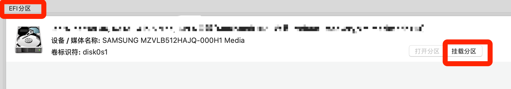

点击下角的小房子回主页，在下方选择config.plist

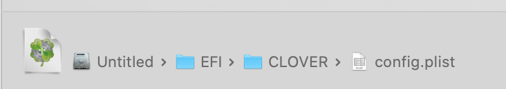

选择左边栏的机型设置


把两个”生成新的“都点一下，选择左下角第二个图标保存，重启。

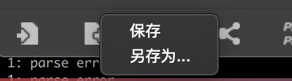

重启后就可以联网登录Apple ID了。但是你会发现触控板用不了。

**2.安装Hackintool，安装禁睿频驱动并重建缓存**

首先在”磁盘“中，挂载efi分区。


然后在”工具“里，点击这个：


选择efi分区，efi/clover/kexts/other中的DisableTurboBoostBattery.kext，安装。


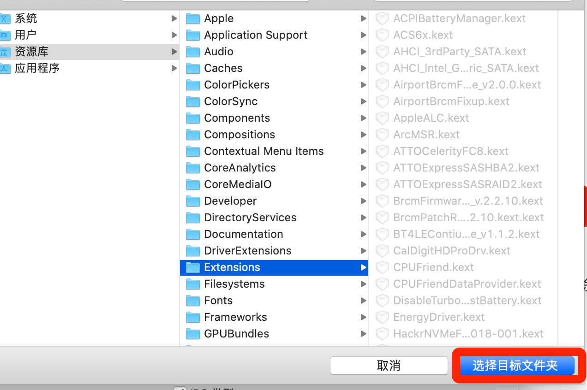

这个驱动的作用是在不插电源时禁用睿频，以省电。如果不需要，就跳过这一步，进入上述文件夹删除这个驱动，直接点击”工具“中底下那一排最右边的那个图标重建缓存。

等待进度条跑完后，直接重启。框框中出现红底代码是正常的。

重启完后你会发现触控板可以用了！

之后更新系统的话，触控板又会不能用。只要重建一下缓存就行了。

新增触控板模拟Force Touch，按下触控板相当于白果上的用力按压触控板。需要先去触控板设置里，调成图中的样子：

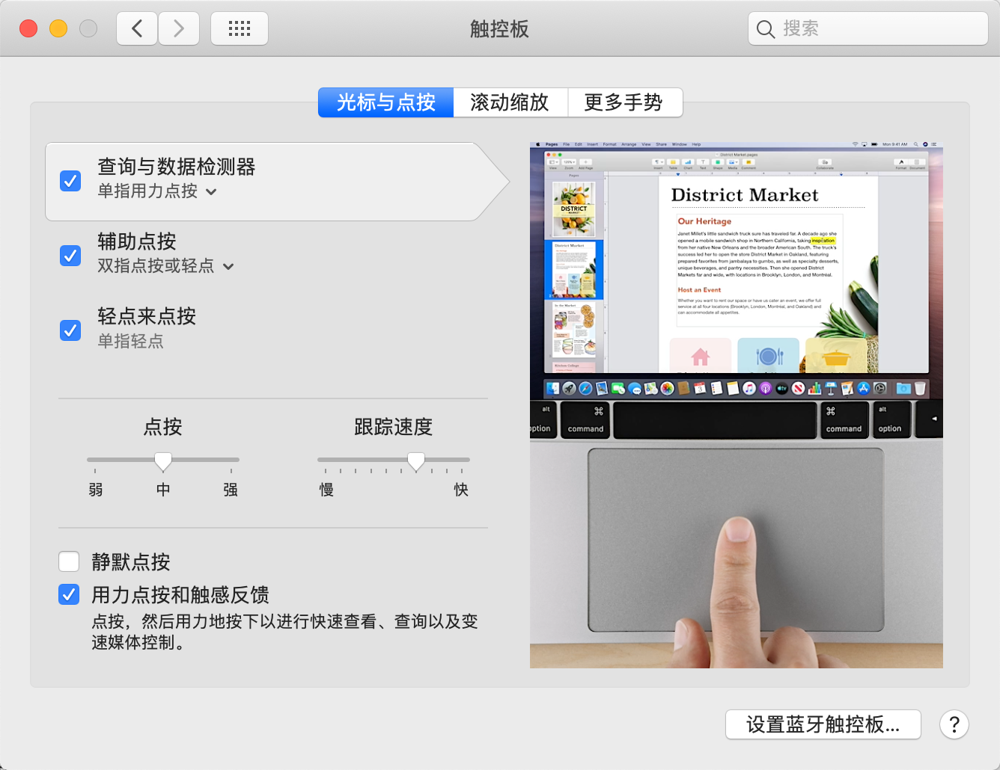

需要在word里面经常使用自带词典查单词的同学（比如我），就这么设置，三指查词：（因为force touch查词在word里面不能用）

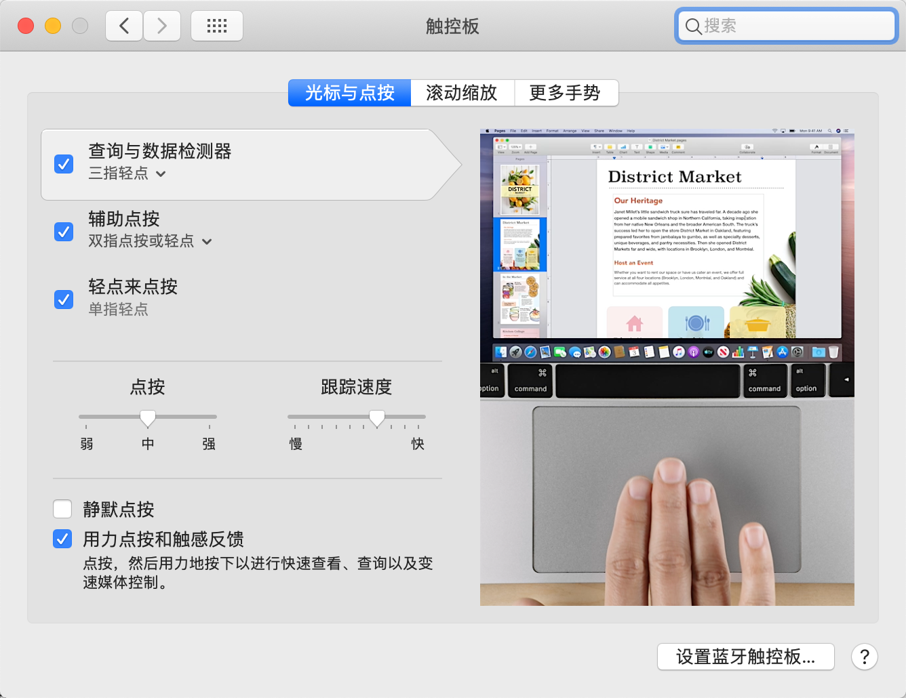

再去辅助功能里：

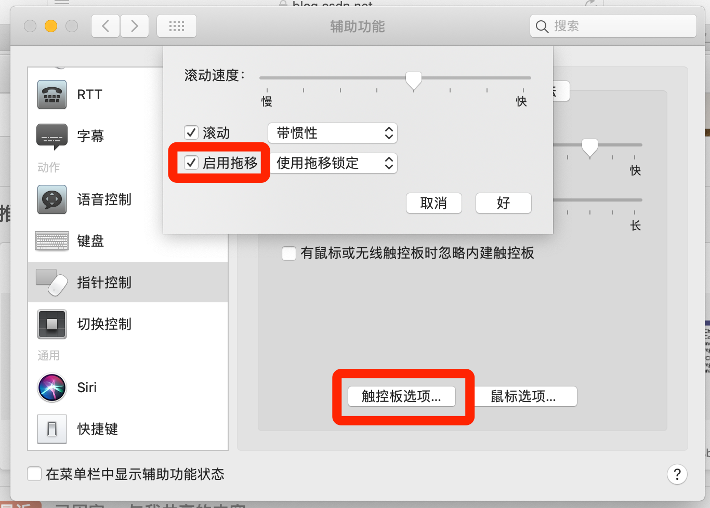

启用拖移里面的具体方式看个人喜好设定。

如果不习惯force touch可以去触控板设置里面关掉用力点按。


**3..开启HiDPI**

打开终端，输入以下代码：

```bash
sh -c "$(curl -fsSL https://html.sqlsec.com/hidpi.sh)"
```

输入密码并回车后，敲2，回车

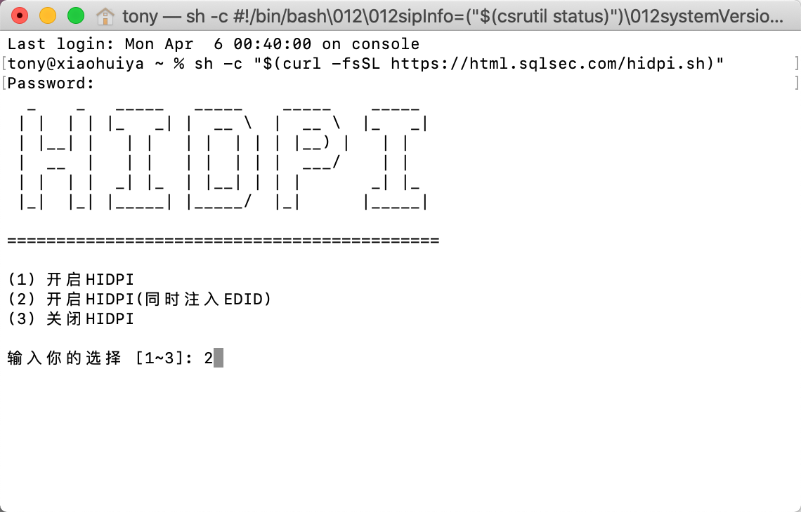


敲3，回车


敲6，回车。（如果你的不是1080P的屏幕，自己尝试其他选项）

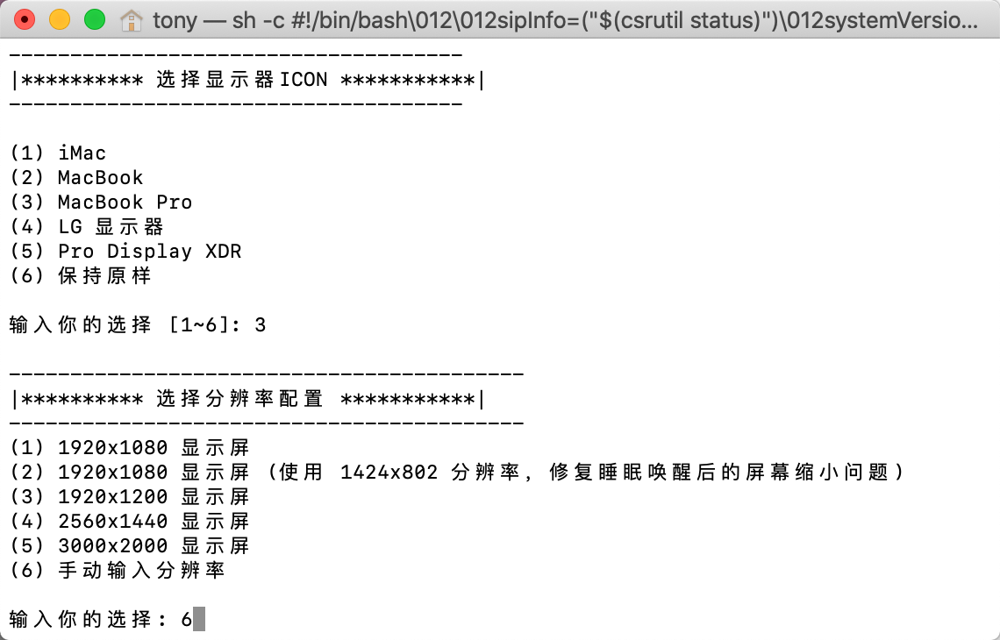


输入1472x828，回车（如果重启后使用一段时间，出现闪屏花屏的状况的话，回到这里，分辨率选择第二个选项，1920x1080修复屏幕缩小问题的那个）

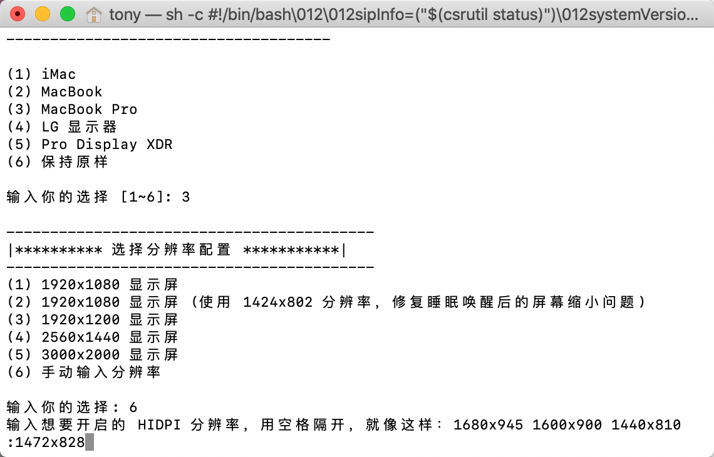


完成后重启，到显示器设置里面确认是否成功开启。


你应该看到这样的一个界面，这代表你已经成功开启HIDPI。 如果”缩放“里面不是这个样子的话，就再试着开启一次。

调成默认缩放，搞定。

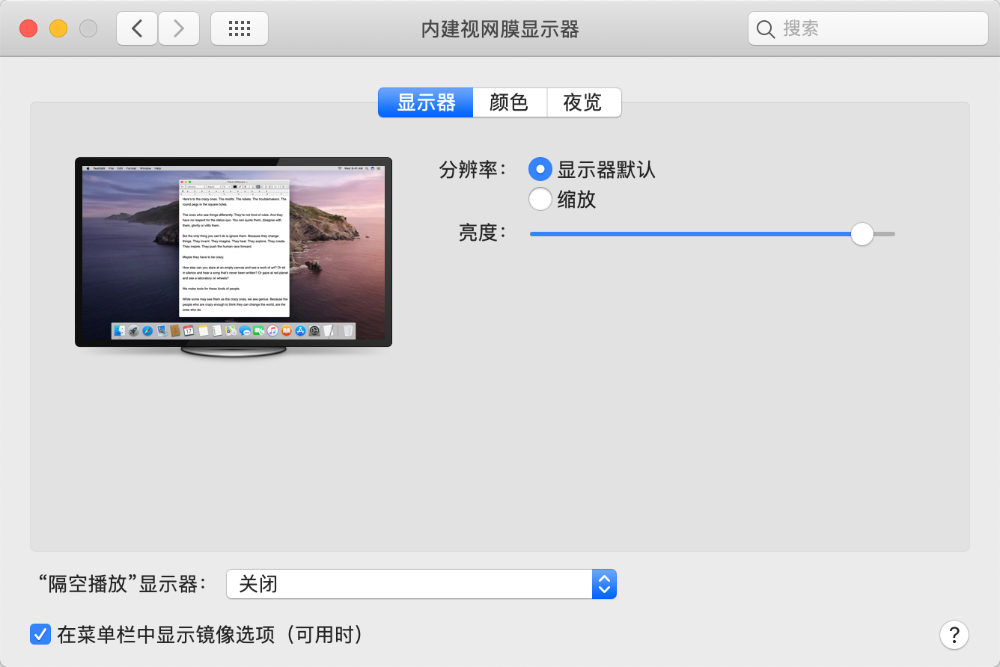

至此，安装完毕。Enjoy it！


感谢贴吧用户@地上一寸方为天，[黑果小兵](https://blog.daliansky.net)，ony-key-hidpi的作者[xzhih](https://github.com/xzhih/one-key-hidpi)，[w2016561536](https://github.com/w2016561536)，远景论坛发小米笔记本PM981解决方法的那位仁兄（ID我忘了。。不好意思哈）和你们。
